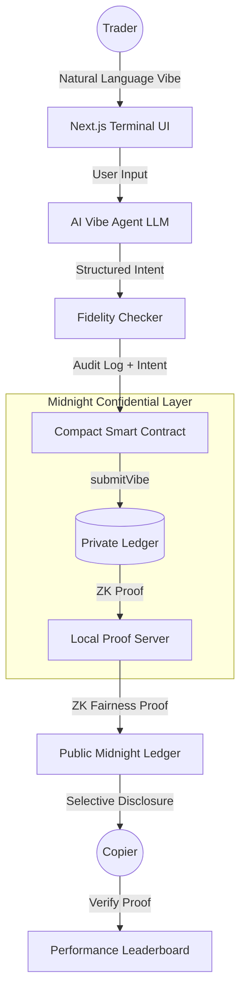

# Vibe Trading Pro | Midnight Network

A natural-language "Vibe Trading" terminal where AI parses strategies and executes them privately on Midnight, providing ZK proofs of fairness and selective disclosure for copy-trading.

## 🏗 Architecture



## 🚀 Key Innovation: "Rational Privacy"
Vibe Trading Pro uses Midnight's unique **Selective Disclosure** to solve the "Whale Doxxing" problem in DeFi.
- **Privacy**: Strategies (vibes) and full trade details stay hidden in the private ledger.
- **Trust**: Traders generate a **ZK Fidelity Proof** which proves "My trade exactly followed my stated vibe" without revealing the vibe itself.
- **Copy Trading**: Followers can subscribe to a "Vibe ID" and receive verifiable proofs that their copy-trades match the master strategy.

## 🛠 Tech Stack
- **Smart Contracts**: Compact v0.28.x (Midnight DSL)
- **Frontend**: Next.js 14, Tailwind CSS, Framer Motion
- **Web3 Integration**: Midnight.js SDK v3.0.x
- **AI Layer**: Llama 3.1 405B via AIML API
- **ZK Infrastructure**: Midnight Local Proof Server

## 🚦 Getting Started

1. **Clone & Install**:
   ```bash
   npm install
   ```

2. **Configure AI**:
   Add your `LLM_API_KEY` (AIML API) to `.env`.

3. **Compile Circuits**:
   ```bash
   npm run compile-contract
   ```

4. **Run Local Network**:
   ```bash
   docker compose up -d
   ```

5. **Launch Terminal**:
   ```bash
   npm run dev
   ```

## 🏆 Hackathon Highlights
- **First-of-its-kind**: Natural-language to Private ZK Execution pipeline.
- **Advanced ZK**: Uses tiered disclosures via `disclose()` for authorized data sharing.
- **Deep AI Integration**: Real-time fidelity scoring and statistical ZK-match verification.
